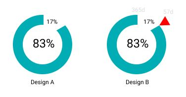

# YearPast.Gadget
A Windows 7 gadget to show past percentage in a year on desktop.

## Screenshot
Show percentage past in a year. i.e.

> 15 %
> past 2019

## How to Install
1. Clone the repo.
2. Copy and paste at ``%localappdata%\Microsoft\Windows Sidebar\Gadgets``.
3. Right-click the desktop and select YearPast gadget.
4. Done.

## Enhancement
Add a circular pie as background to indicate the percentage.

[[Edit/View]](https://www.figma.com/file/XOTTPwCH3wWOovJ2InI77aES/)

## References
- https://www.experts-exchange.com/articles/2000/Create-a-Win7-Gadget.html
